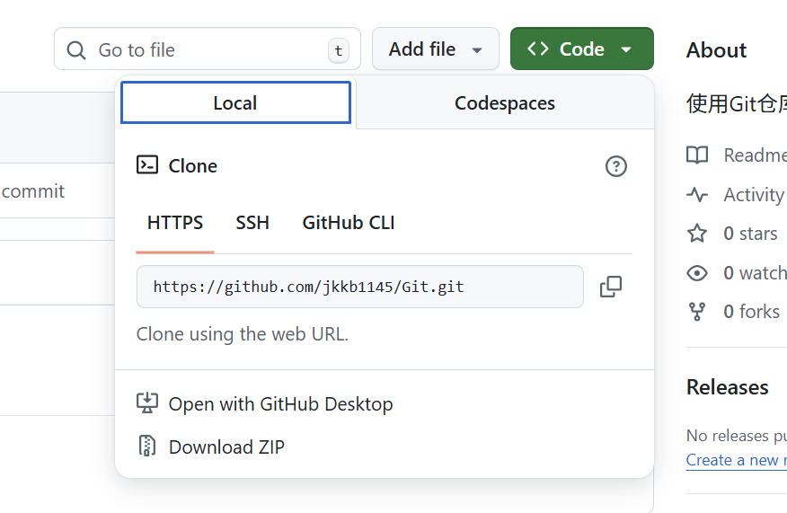

# Git连接github实现代码托管，备份

## Git配置

```
git config --global user.name "jkkb"
git config --global user.email "2671817496@qq.com"
```

为Git绑定用户名与邮箱(jkkb, 2671817496@qq.com)

## 克隆GitHub上他人的仓库

```
git clone 项目仓库地址
```

项目仓库地址来自于:

打开一个项目, 点击右上Code, 复制其HTTPS地址



## 将本地文件夹设为Git代码仓库

打开本地文件夹,右键,打开GitBash输入

```
git init
```

## 提交代码到暂存区

```
git add 文件名
git add . (提交全部代码)
```

## 提交代码到Git仓库

```
git commit -m "备注内容"
```

提交代码强制需要备注信息,不输入会跳转至一个未知页面,在末端输入:wq退出,重新提交

## 查看提交记录

```
git log
```

## 回溯代码

```
git reset --hard commitid
```

commitid来自于: 查看提交记录时, 每次提交都会对应一个commitid, 如果要回溯到此次提交, 就用他的commitid

## 分支

```
git branch
```

查看目前所有分支, 绿色为当前使用分支

> 我的gitbash已不适用,目前正在使用的Git仓库与分支的信息全部标识在: 每次执行命令后自动输出的文字的最后

### master

master是系统自动创建的分支, 用于保存测试后稳定可运行的代码, 一切的代码修改都不能在master上进行

### 其他分支

```
git checkout -b develop
```

创建了一个名为develop的其他分支

代码修改可在其他分支进行

```
git checkout 分支名
```

切换到指定分支(master; develop)

### 合并其他分支到master

在其他分支完成开发,测试稳定后,需要将修改合并到master分支上

首先执行之前的add,commit命令在其他分支提交代码

然后执行

```
git checkout master
```

回到master分支

```
git merge develop
```

将develop分支上做的修改合并到master

## git与GitHub配合使用

### 将本地Git与GitHub仓库绑定

在已经建好的Git仓库文件夹中右键打开gitbash

输入

```
git remote add origin 项目仓库地址
```

将该Git仓库绑定给一个名为origin(可修改)的远程仓库

### 推送代码到GitHub

#### 身份验证

使用SSH链接+密钥认证

将电脑信息与github绑定

只要在绑定时使用SSH链接就不用再校验权限

##### 问题1

原本22端口无法访问, 

解决: 修改.ssh文件下的config文件使其使用443端口

> 详情搜索:ssh: connect to host github.com port 22: Connection refused问题

##### 问题2

创建ssh密钥时不小心输入了密码

解决: 弹出**Enter passphrase for key '/c/Users/jkkb114514/.ssh/id_rsa':**要求输入密码, 输入密码y,并按下回车

#### 上传代码

首先执行add,commit在本地仓库提交代码

然后执行

```
git push -u origin master
```

将master分支上传到该仓库连接的远程仓库,实现双端备份